<table>
  <tr>
    <td valign="top">
      
    </td>
    <td valign="top">
      
    </td>
  </tr>
</table>

<h1 align="center">Afrin</h1>

  <strong>Software Engineer • Builder • Creator</strong>

  
  
  

